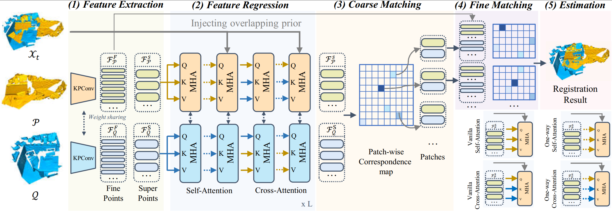

# Adaptive Multi-step Refinement Network for Robust Point Cloud Registration

PyTorch implementation of the paper:

Adaptive Multi-step Refinement Network for Robust Point Cloud Registration

## Introduction

Point Cloud Registration (PCR) estimates the relative rigid transformation between two point clouds of the same scene. Despite significant progress with learning-based approaches, existing methods still face challenges when the overlapping region between the two point clouds is small. In this paper, we propose an adaptive multi-step refinement network that refines the registration quality at each step by leveraging the information from the preceding step. To achieve this, we introduce a training procedure and a refinement network. Firstly, to adapt the network to the current step, we utilize a generalized one-way attention mechanism, which prioritizes the last step's estimated overlapping region, and we condition the network on step indices. Secondly, instead of training the network to map either random transformations or a fixed pre-trained model's estimations to the ground truth, we train it on transformations with varying registration qualities, ranging from accurate to inaccurate, thereby enhancing the network's adaptiveness and robustness. Despite its conceptual simplicity, our method achieves state-of-the-art performance on both the 3DMatch/3DLoMatch and KITTI benchmarks. Notably, on 3DLoMatch, our method reaches 80.4\% recall rate, with an absolute improvement of 1.2\%. Our code will be made public upon publication.



## Requirements

Follow [GeoTransformer](https://github.com/qinzheng93/GeoTransformer) to install the dependencies.

```
pip install -r requirements.txt
python setup.py build develop
```
    
## 3DMatch & 3DLoMatch

### Data preparation

[3D prior data](https://drive.google.com/file/d/1ArrJvTzlbQjSHZi3Zl0oHesuoE7Nr16P/view?usp=sharing) Unzip the file, you can get two folders, one is for training, the other is for testing/validating.

[Point cloud data](https://github.com/prs-eth/OverlapPredator)
The dataset is downloaded from [PREDATOR](https://github.com/prs-eth/OverlapPredator).

Unzip the prior data:
### Testing

Use the following command for testing.

```bash
bash eval_multi.sh 0 3DMatch
```
or
```bash
bash eval_multi.sh 0 3DLoMatch
```


## Acknowledgements
- [PREDATOR](https://github.com/prs-eth/OverlapPredator)
- [GeoTransformer](https://github.com/qinzheng93/GeoTransformer)
- [PEAL](https://github.com/Gardlin/PEAL)

